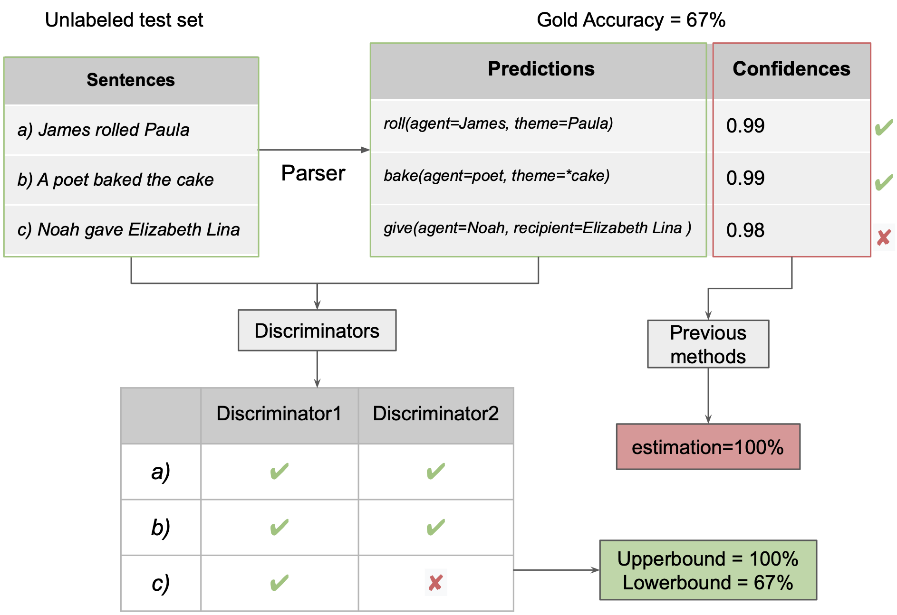
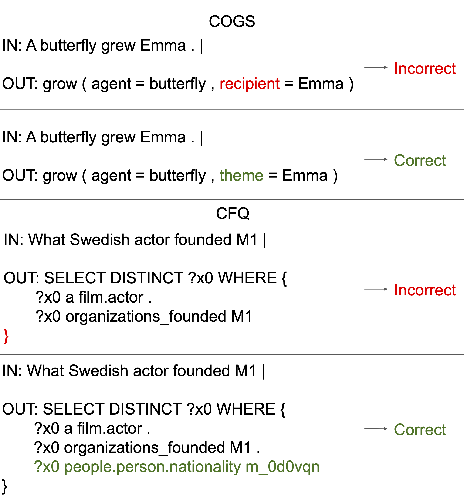
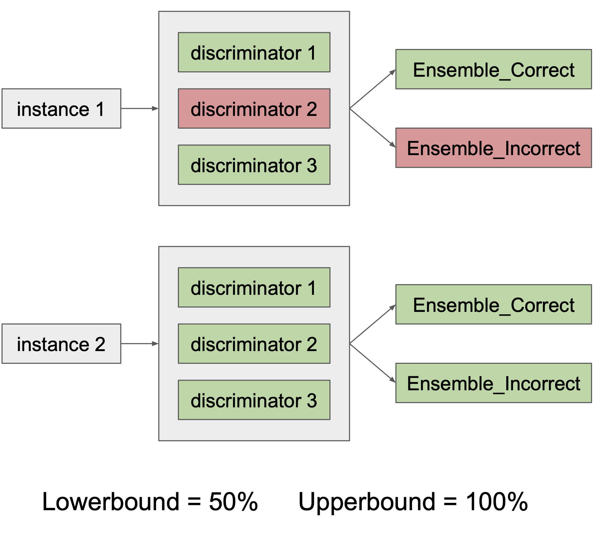
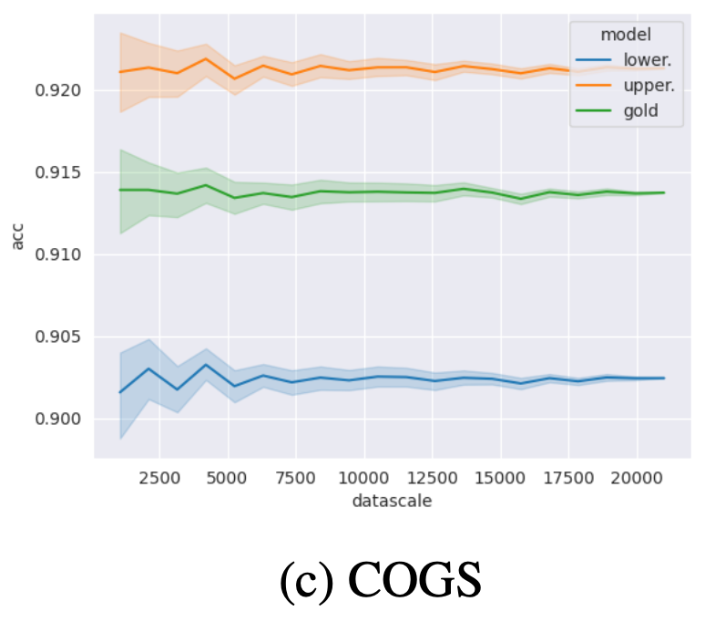
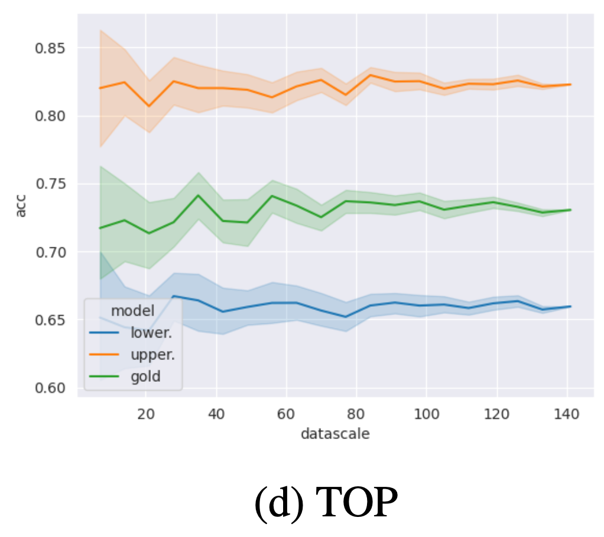

    

## Abstract

The ability to predict an NLP model's accuracy on unseen, potentially out-of-distribution data is a prerequisite for trustworthiness. We present a novel model that establishes upper and lower bounds on the accuracy, without requiring gold labels for the unseen data. We achieve this by training a **discriminator** which predicts whether the output of a given sequence-to-sequence model is correct or not. We show across a variety of tagging, parsing, and semantic parsing tasks that the gold accuracy is reliably between the predicted **upper and lower bounds**, and that these bounds are remarkably close together.

The example above illustrates how our method works compared to previous confidence-based methods. On an unseen out-of-distribution (OOD) test set, the parser's confidence is usually an unreliable estimate of its performance. Earlier work has attempted to calibrate these confidence scores to the OOD set. By contrast, our discriminators **discriminate** whether the parser's predicted output is correct for the test input sentence or not. By using a **voting mechanism** over an ensemble of discriminators, our method provides reliable upper and lower bounds for the accuracy.  

## Method

The core of our method is a "correctness discriminator model." This model is crucial in determining the accuracy of predictions made by a sequence-to-sequence model (referred to as the "parser") on new, unseen data.

#### Discriminator Model Design

- **Purpose:** The discriminator acts as a binary classifier. Its primary function is to assess if a predicted sequence correctly matches a given natural language sentence.
- **Structure:** We finetune a pretrained encoder-decoder language model (T5) as a discriminator. The encoder processes the combination of the input sentence and the predicted sequence, and the decoder then categorizes the combination as either 'Correct' or 'Incorrect'.

#### Obtaining Training Data

A key technical challenge is to obtain negative training instances for the discriminator, because the trained parser makes correct predictions on most of the instances on which it was trained.

    

- **Positive Examples:** These are sourced directly from the training set used for the parser.
- **Negative Examples**: Instead of synthesizing errors with hand-designed noise functions (e.g. replacement, deletion), we generate negative examples from the intermediate checkpoints of the parser during its training. Before the parser reaches perfect accuracy on its training set, we capture its incorrect predictions as negative examples.

#### Predicting Accuracy Bounds

    

We predict upper and lower bounds for the test accuracy by parsing all test instances with the trained parser.
We then run an ensemble of discriminators on the prediction for each test instance.
We count the test instance as "probably correct" if at least one discriminator judges it as correct.
We count it as "probably incorrect" if at least one discriminator judges it as incorrect.
Calculating accuracies on these ensemble predictions yields an upper and lower bound for the parser's true accuracy.
Note that at no point does the model look at the gold annotation of the test instance,
making it applicable even if only unlabeled test data is available.

## Our bounds reliably capture gold accuracy

Our predicted upper and lower bounds accurately capture the gold accuracy (i.e. **high reliability**), across a number of datasets that involve tagging, parsing, and semantic parsing, in both in-distribution and out-of-distribution settings. This pattern holds for 9 of 10 our datasets, and even for POS-COGS, where this conclusion is not true, the gold accuracy only violates the bounds by a small amount. Meanwhile, the predicted upper and lower bounds are usually close (i.e. **high tightness**). 

Although this is not the main goal of our work, our method also compares favorably to earlier work for predicting point estimates of the accuracy (e.g. *Mean* row in *Ours* results).  It substantially outperforms previous methods and achieves a relatively low AE score (absolute estimation error) on semantic parsing and POS tagging tasks. On constituency parsing tasks, our method does not outperform [ATC](https://arxiv.org/abs/2201.04234), a strong baseline for predicting generalization performance, but is still better than other baselines. Our method is also especially useful for OOD test sets, where confidence-based methods yield a much larger AE. 

    

## Impact of test sample

The accuracy of the bound predictors is robust to the choice of sample from the test set; even with relatively small sample sizes, we already obtain good estimates. With increasing sample size, the variation of predictions across samples diminishes.

    
    &nbsp; &nbsp;
    

